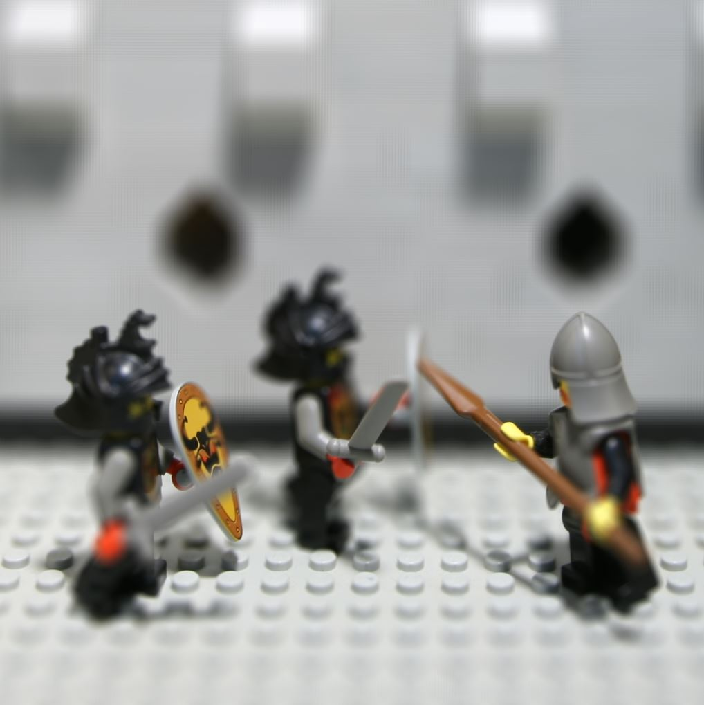

LightField
==========

[](https://travis-ci.org/tatsy/LightField)

> Light field image viewer with Qt5.

## Installation

You need Qt5 to build this project. With Qt5, you can easily build the project using CMake.

```shell
$ git clone https://github.com/tatsy/LightField.git
$ cmake .
$ cmake --build .
```

## Usage

This viewer accepts light field images from [Stanford Light Field Archive](http://lightfield.stanford.edu/lfs.html). You can find the rectified datasets at this archive.

After downloading the rectified dataset and unzip the archieve, you can get several images corresponding to each camera view. Then, run the viewer, push the ```Load``` button, and choose the unzipped folder named ```rectified``` (you can change the folder name, but please make sure that the chosen directory contains all the downloaded images).

You can change the length to the focal plane and aperture size with slider interface. Also you can change the view point by clicking/dragging on the view.

## Screen shot



## License

* MIT License, Tatsuya Yatagawa (tatsy)
